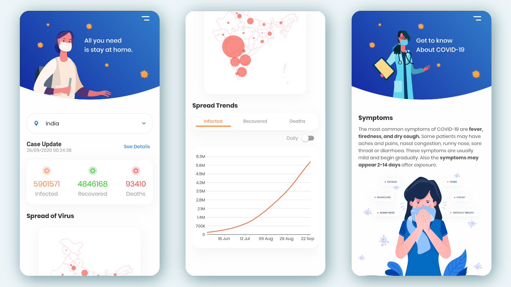
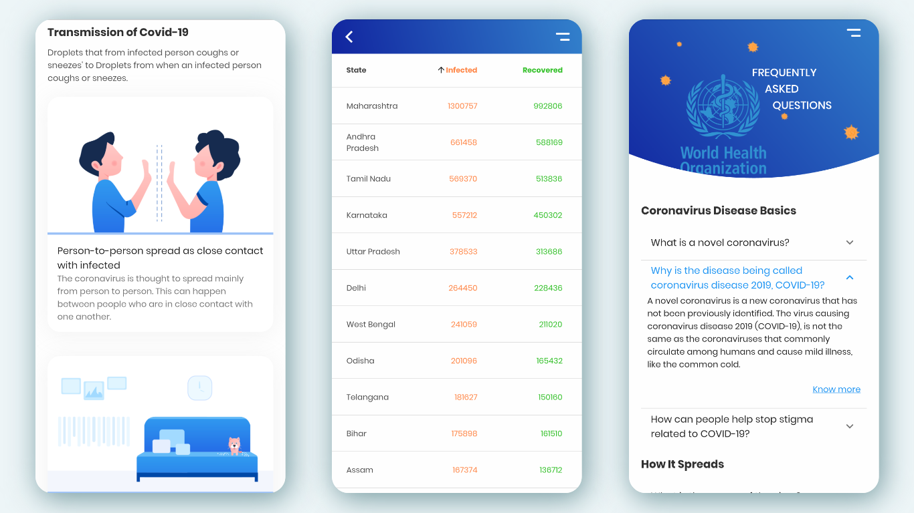

# Covid-19 INDIA

COVID-19 INDIA, an application with an attempt to connect the countrymen of India and providing information to all the Indians regarding the deadly novel coronavirus. This app basically aims at providing information regarding the number of cases of affected people with the coronavirus, the number of casualties and the number of people recovered from the virus in their locality, city and their country. It informs the users of the app regarding risks, best practices, relevant advisories pertaining to the containment of COVID-19 and different helpline numbers in India. It makes sure that the countrymen remain healthy at all cost with trusted up to date information from reliable sources of India.


### Prerequisites

- Flutter

### Installing

```
$ git clone https://github.com/rohitbakoliya/covid-19INDIA.git
$ flutter pub get
```

### Gallery







### Credits

- [COIVD-19 API](https://github.com/covid19india/api)
- [UI](https://www.uplabs.com/posts/coronavirus-information-concept)
